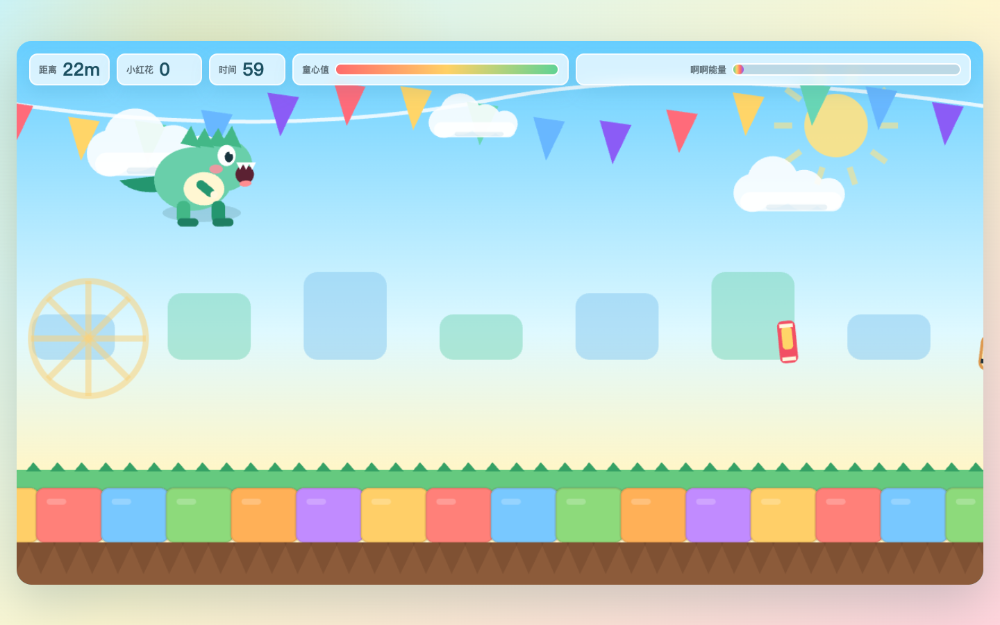

# 啊啊龙大冒险

六一派对用的声控跑酷小游戏。玩家不用键盘，只要对着麦克风持续“啊——”，就能给啊啊龙提供能量，让它在空中飘起来。

[在线试玩](https://eatchip.github.io/aaa-dragon-adventure/)



## 玩法

- 对着麦克风持续“啊——”，啊啊龙会获得能量并在空中飘起来。
- 停止发声，啊啊龙会落地继续跑。
- 撞到障碍会扣童心值，不会立刻失败。
- 收集小红花和童年零食可以恢复童心，躲开作业本怪、闹钟怪、KPI 路牌。

## 本地运行

在当前目录启动一个本地服务，然后打开浏览器访问对应地址。麦克风权限通常需要在 `localhost` 下才能正常使用。

```bash
python3 -m http.server 4173
```

浏览器地址：

```text
http://localhost:4173/
```

如果麦克风不可用，可以用空格键试玩。
